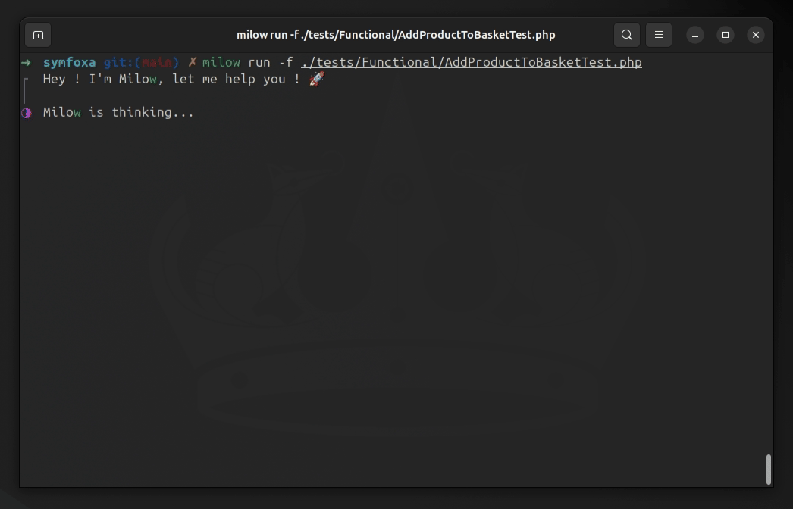

# Milow : The Test-Driven AI Assistant 🚀

Milow is still in beta version, he is waiting for your feedback and contributions.



## Setup

Milow runs on [Bun](https://bun.sh/). Ensure you have the latest version of Bun installed before proceeding.

#### 1. Install Milow globally as a CLI :

   ```sh
   curl -sSL https://raw.githubusercontent.com/etienneleba/milow/main/install.sh | bash
   ```

#### 2. Obtain your API key. Make sure to add payment details to activate the API :

- [OpenAI](https://platform.openai.com/account/api-keys)

#### 3. Init Milow :

   ```sh
      milow init # this command creates a milow.config.json file
   ```

- **testCommand**: The command you use to run your tests
- **model** : The model you want to use. Run `milow check models` to see all available models
- **viewableFilesPattern** : Glob pattern of all files Milow can access
- **contextFilesPattern** : Glob pattern of files included in Milow's context

#### 4. Export the API key :

   ```sh
   export OPENAI_API_KEY=sk-*******
   ```

#### 5. Set up Milow's documentation context :

Create a `docs/milow` folder to store all documentation Milow can use to understand your project. Examples of useful
files to include:

- **`business.md`**: Describe the business context of your project.
- **`folder_structure.md`**: Explain the project architecture and the purpose of folders visible to Milow.
- **`technical_stack.md`**: Provide details about the language, framework, and libraries used in the project.
- **`test_strategy.md`**: Describe your testing approach, including the use of mocks, fakes, or in-memory objects, and
  your workflow (TDD, ATDD, Test-First, Wishful Thinking Programming, etc.).
- **`examples.md`**: List files Milow can use as examples (e.g., controllers, domain models, commands, command handlers,
  tests, buses, etc.).

The more accurately you describe your project, the more efficient Milow will be in generating quality code.


---

## Usage

You can run Milow using the following command:

```sh
milow run
```

You can also provide more specific commands:

```sh
milow run -f ./tests/functional/milow.test.ts
```

```sh
milow run -p "I want to create the AddProductToBasket feature" # This prompt will remain in Milow's context throughout the interaction
``` 

---

## Contributing

The guidelines to contribute : [Contributing guidelines](docs/CONTRIBUTING.md)

### Features

- [ ] A function patch file, to avoid rewrite all the file (Quite hard to do well with an LLM)
- [ ] Confirm before writing option in the config  
- [ ] Context buffer size in the config 

### Support another model provider 

Milow has been designed to abstract the concept of model, so it's quite easy to add new model provider (Claude, Mistral, Gemini, etc). 

Here the steps to create a new Model Provider : 

#### 1. Create the model provider file 

In `src/infrastructure/model/models` create a new file, I'll take OpenAI for the exemple here : 

```typescript
// src/infrastructure/model/models/OpenAIModel.ts
export default class OpenAIModel {
  ...
}
```

#### 2. Implements the interfaces 

There are 2 interfaces to implements the `Model` interface and the `ModelProvider` interface. 

```typescript
...

export default class OpenAIModel implements Model, ModelProvider {
  private client: OpenAI;
  private _modelName: string;

  constructor() {
  }

  async call(
    context: Context,
    functionSchema: object[],
  ): Promise<ModelResponse> {...}

  getModelNames(): string[] {
    return ["gpt-4o", "gpt-4o-mini", "gpt-4-turbo", "gpt-4"];
  }

  set modelName(value: string) {
    this._modelName = value;
  }

  set apiKey(value: string) {
    this.client = new OpenAI({
      apiKey: value,
    });
  }

  getAPIKeyName(): string {
    return "OPENAI_API_KEY"
  }
}

```

#### 3. Implement the Call 

This function is where everything happens, most of the model providers user the same API interface, so you can use the `GenericTranslator` to help you convert the Milow models to the provider ones. 

```typescript
...

export default class OpenAIModel implements Model, ModelProvider {
  private client: OpenAI;
  private _modelName: string;
  private translator: GenericTranslator;

  constructor() {
    this.translator = new GenericTranslator();
  }

  async call(
    context: Context,
    functionSchema: object[],
  ): Promise<ModelResponse> {
    const messages = this.translator.translateContextToMessages(
      context.conversations,
    );
    const tools = this.translator.translateFunctionsToTools(functionSchema);

    const params = {
      messages: messages,
      model: this._modelName,
      tools: tools,
      temperature: 0.3,
      top_p: 0.1,
    };

    const completion = await this.client.chat.completions.create(params);

    const message = completion.choices[0].message;

    let functionCalls = [];
    if (message.tool_calls) {
      functionCalls = this.translator.translateToolsToFunctions(
        message.tool_calls,
      );
    }

    return new ModelResponse(message.content, functionCalls);
  }

  ...
}

```

#### 4. Register the new provider

Then you just need to add the new provider to the [`ModelResolver`](src/infrastructure/model/ModelResolver.ts), and that's it ! 

#### 5. Share to the community

You can create a pull request to share it with the community ! 🚀

---

## They inspired Milow

- [di-sukharev/AI-TDD](https://github.com/di-sukharev/AI-TDD)
- [Bouke Nijhuis | TDD & generative AI - a perfect pairing ?](https://www.youtube.com/watch?v=HpYpctLxfJk)


